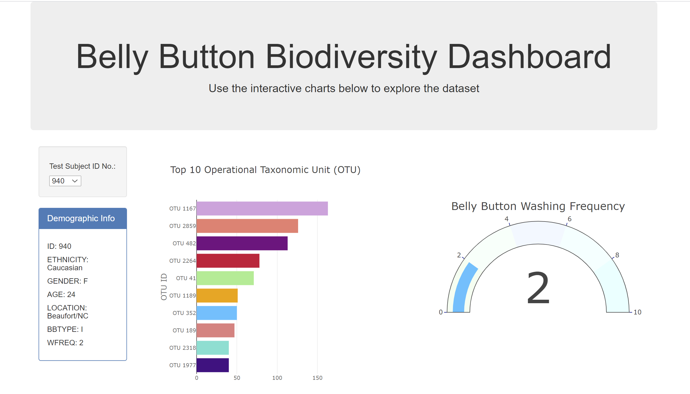
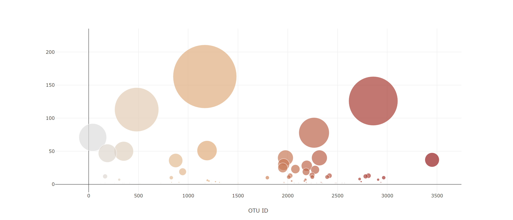

# Belly Button Biodiversity

https://kayannr.github.io/belly-button-biodiversity/Belly-Button-Biodiversity/index.html

## Background
An interactive dashboard to explore the Belly Button Biodiversity dataset, which catalogs the microbes that colonize human navels. The dataset reveals that a small handful of microbial species (also called operational taxonomic units, or OTUs, in the study) were present in more than 70% of people, while the rest were relatively rare.

## Plotly
 
The following are tasks completed: 
1.  `samples.json` is read using D3 library

2. A horizontal bar chart with a dropdown menu to display the top 10 OTUs found in that individual is created. The following are used for the interactive bar chart: 

* Use `sample_values` as the values for the bar chart.

* Use `otu_ids` as the labels for the bar chart.

* Use `otu_labels` as the hovertext for the chart.
3. A bubble chart that displays each sample. The following are used for the interactive bubble chart: 

* Use `otu_ids` for the x values.

* Use `sample_values` for the y values.

* Use `sample_values` for the marker size.

* Use `otu_ids` for the marker colors.

* Use `otu_labels` for the text values.

4. Display the sample metadata, i.e., an individual's demographic information.

5. Display each key-value pair from the metadata JSON object somewhere on the page.

6. Update all of the plots any time that a new sample is selected.

